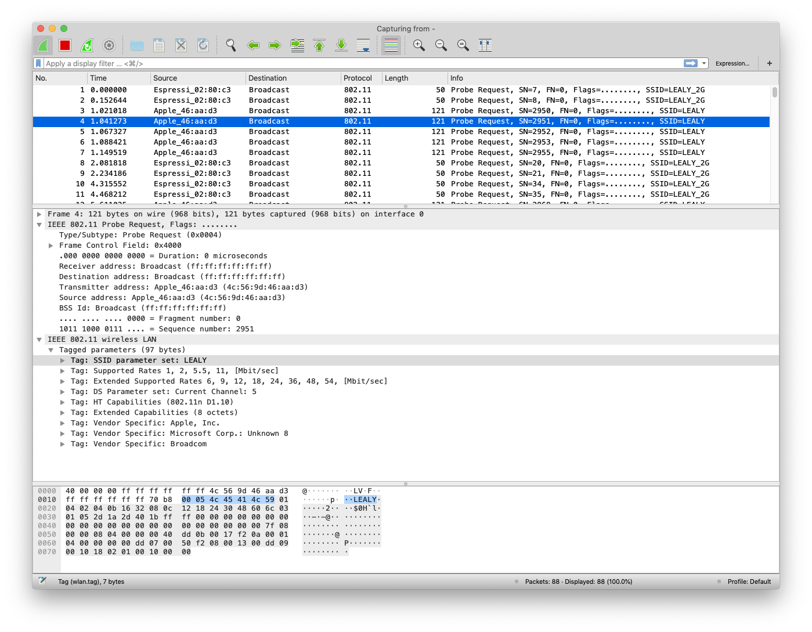

# ESP32 Wifi Sniffer for live Wireshark capture

Use ESP32 promiscuous mode to capture frame and send them over serial connection to a Python script that writes a PCAP file and start Wireshark with live capture.

Works on OS X, Linux.

Serial data is human readable, with packet timestamp + size, then packet data as hexstrings:

```
$ make monitor
Packet   1.747875 101 101
DATA:0100000063690b00650000006500000040000000ffffffffffffb8e85617ceceffffffffffff80c100054c45414c59010402040b1632080c1218243048606c0301062d1aad4917ffff0000000000000000000000000000000000000000007f080400000000000040dd0b0017f20a00010400000000
Packet   4.814337 210 210
DATA:04000000016d0c00d2000000d200000040000000ffffffffffffb827eb98c70bffffffffffff80bc0000010402040b1632080c1218243048606c0301062d1a21001fff00000000000000000000000000000000000000000000dd690050f204104a000110103a00010010080002314810470010fb97404916565875a860726c0fe2c424105400080000000000000000103c00010110020002000010090002000010120002000010210001201023000120102400012010110001201049000600372a000120dd11506f9a0902020025000605005858045106dd09001018020000000000
```

`Capture.py` decode this serial stream, saves a PCAP file names `capture_YYYYMMDD_HHMMSS.pcap` and opens Wireshark.

# Building

Builds with ESP-IDF v4.0

Configure your serial port:

`$ make menuconfig`

Build & flash:

`$ make flash`

Monitor to see the packets:

```
$ make monitor
...
Packet   1.747875 101 101
DATA:0100000063690b00650000006500000040000000ffffffffffffb8e85617ceceffffffffffff80c100054c45414c59010402040b1632080c1218243048606c0301062d1aad4917ffff0000000000000000000000000000000000000000007f080400000000000040dd0b0017f20a00010400000000
...
```

Stop monitor `CTRL+]` and start `Capture.py`

```
$ ./Capture.py
Creating capture file: capture_20200702_114220.pcap
Starting Wireshark
Waiting for packets...
Packet  451.227441 121 121
Packet  451.237686 121 121
Packet  451.251294 121 121
...
```

Enjoy:



